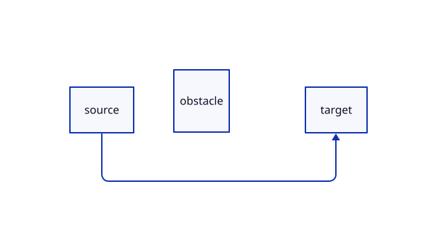

# Weftan

[](https://github.com/nelsonjchen/weftan/actions/workflows/ci.yml)

**TALA-shaped graph layout, rewoven in Rust.**

[Development](docs/development.md) · [Compatibility status](docs/status.md)

Weftan is an offline graph-layout engine and D2 plugin. Its Rust pipeline is
translated from Go source reconstructed from TALA v0.4.3 release artifacts;
it is recovery-informed, not a clean-room reimplementation.



## Quick start

Install Weftan from this repository, then select it like any other D2 layout
plugin:

```sh
cargo install --git https://github.com/nelsonjchen/weftan d2plugin-weftan
d2 --layout=weftan input.d2 output.svg
```

The installed executable is named `d2plugin-weftan`; D2 discovers it on
`PATH`. To build from a checkout instead:

```sh
cargo build --release -p d2plugin-weftan
PATH="$PWD/target/release:$PATH" d2 --layout=weftan input.d2 output.svg
```

### WebAssembly

The `weftan-wasm` crate exposes both the core graph API and the serialized D2
adapter to browsers, Node.js, and bundlers. With `wasm-pack` installed:

```sh
node scripts/build-wasm.mjs --target web --release
```

```js
import init, { layout_d2_json } from "./crates/weftan-wasm/pkg/weftan_wasm.js";

await init();
const laidOut = JSON.parse(
  layout_d2_json(serializedD2Graph, '{"seeds":[1]}'),
);
```

The WASM build runs synchronously and evaluates seed and routing candidates
serially. Native builds retain their existing parallel candidate evaluation.

## What it handles

Weftan provides the complete recovered placement, compaction, routing, and
label-finalization pipeline behind the normal D2 plugin protocol. The adapter
preserves unknown serialized-graph fields and advertises these D2 features:

- `near_object`
- `container_dimensions`
- `top_left`
- `descendant_edges`
- `routes_edges`

The engine covers layered placement, recursive and fixed-size containers,
explicit grids, per-container direction, locked coordinates, clusters, trees,
sequences, disconnected-component packing, obstacle-aware orthogonal routing,
shape-border tracing, and node and edge label placement.

## Current parity

The current optimized macOS ARM64 measurement compares Weftan with the
pristine TALA v0.4.3 plugin over 121 serialized graphs.

| Measurement | Result |
| --- | ---: |
| Successful single-seed comparisons, seeds 1–10 | **1,200 / 1,200 exact** |
| Boxes | **29,640 / 29,640 exact** |
| Routes and edge-label placements | **9,740 / 9,740 exact** |
| Node-label and icon placements | **59,280 / 59,280 exact** |
| Successful combined RaceSeeds comparisons, seeds 1–10 | **113 / 113 exact** |

One oversized grid case timed out in TALA for every isolated seed, so it is
reported as an error rather than counted as a match. The combined RaceSeeds
run had eight oracle-timeout cases and no geometry mismatch among successful
cases. The precise timeout set can vary with concurrent load, so the checked-in
record captures the exact measured run.
These are corpus measurements, not a claim that every possible D2 graph is
identical. See [the dated measurement record](docs/tala-parity-baseline.json)
and [status notes](docs/status.md) for the exact scope and commands.

## Reproducible choices

`--weftan-seeds` accepts a comma-separated list of signed 64-bit integers.
Each isolated seed is deterministic. When several seeds are supplied, Weftan
runs the recovered RaceSeeds selection contract and publishes the selected
candidate.

```sh
d2 --layout=weftan \
  --weftan-seeds=1,2,3 \
  --weftan-report=layout-report.json \
  input.d2 output.svg
```

The optional JSON report records candidates, scores, warnings, and the
selected seed without changing protocol output on stdout.

## Architecture

The workspace has four intentionally narrow crates:

- `weftan`: the graph model and recovered layout engine;
- `weftan-d2`: the lossless serialized-D2 adapter; and
- `weftan-wasm`: browser and JavaScript bindings for both library layers; and
- `d2plugin-weftan`: the D2 binary-plugin entry point.

The implementation keeps source-shaped stage and data ownership where parity
depends on it, while later Rust refactors improve memory layout and performance
without replacing the recovered behavior with fixture-specific rules.

## Development

Normal development uses the unoptimized Rust profile. Full corpus and
performance-sensitive validation uses the repository's optimized `oracle`
profile. See [the development guide](docs/development.md) for checks and parity
commands.

## Provenance and licensing

Weftan is licensed under [MPL-2.0](LICENSE), matching D2 and its open-source
TALA engine. Read [the implementation provenance](docs/provenance.md) for
its recovery-based translation history and the upstream source comparison.
Third-party portions retain their licenses and attribution in
[THIRD_PARTY_NOTICES.md](THIRD_PARTY_NOTICES.md) and
[DEPENDENCY_NOTICES.md](DEPENDENCY_NOTICES.md).

See [SOURCE.md](SOURCE.md) for corresponding source and redistribution instructions.
